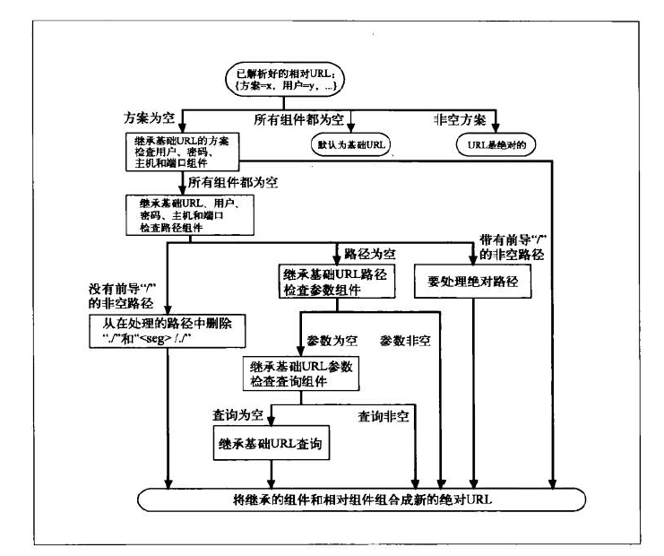

#HTTP-note
##URL
*URI*（Uniform Resource Identifier，统一资源标识符）是一类更通用的资源标识符，有两个主要的子集*URL*（Uniform Resource Locator，统一资源定位符）和*URN*（Uniform Resource Name，统一资源名称）构成，URL是通过描述资源的位置来标识资源的，而URN则是通过名字来识别资源的。  

*URL*的组成分为 方案：//服务器位置/路径  
###组成
大多数*URL*方案的URL语法都建立在由9部分构成的通用格式上：  
\<scheme\>://\<user\>:\<password\>@\<host\>:\<port\>/\<path\>;\<params\>?\<query\>#\<frag\>
####scheme
必须以一个字母符号开始，由第一个：符号来将其与URL的其余部分分隔开来，是大小写无关的，例如http://
####host port
提供主机ip地址和主机上的端口号  
####user password
如果使用的url方案要求输入用户名和密码，但是url没有，则浏览器会提供一个默认的用户名密码 如anonymous
####path
说明了资源位于服务器的什么地方
####params
由字符;将其与URL的其余部分分隔开来，为应用程序提供了访问资源所需的所有附加信息，参数名和值是键值对由等号分隔，参数间又;分隔
####query
查询字符串，由？与其他部分分隔，同样为名值对，名值间用&分隔
####frag
片段组件，用来表示资源的内部片段，例如：可以指向HTML文档中一个特定的图片或者小节  
使用过#与其他部分分隔（服务器处理的是整个对象，url片段仅由客户端使用）  

###URL快捷方式
基础url作为相对url的参考点使用的，可以来源于以下几个地方  

1. 在资源中显示提供，如html中的<base>  

2. 封装资源的基础URL  

3. 没有基础URL，可能只是一个不完整或损坏了的URL  

