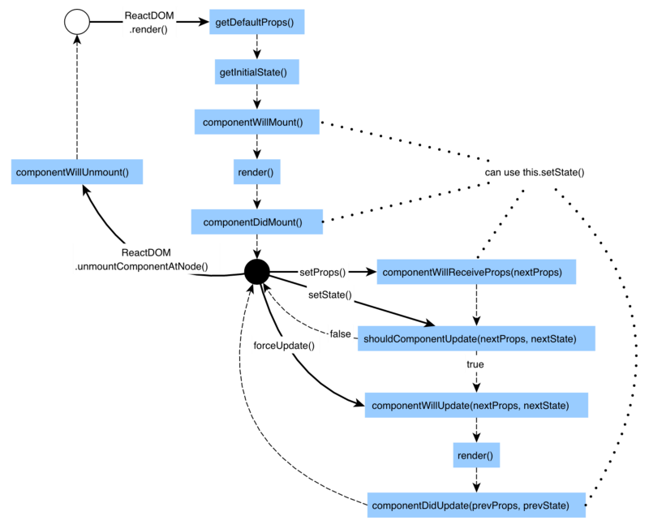

# react生命周期总结

## React组件提供了生命周期的钩子函数去响应组件不同时刻的状态，组件的生命周期如下：

* 实例化
* 存在期
* 销毁期

## 钩子函数

整体情况如下图所示



### 实例化

首次执行组件时，下面的函数会被执行

* getDefaultProps()
  * 这个方法是用来设置组件默认的props，组件生命周期只会调用一次。但是只适合React.createClass直接创建的组件
* getInitialState()
  * 设置state初始值，在这个方法中你已经可以访问到this.props。getDefaultProps只适合React.createClass使用。使用ES6初始化state方法如下：
    * ```javascript
      class Component extends React.Component{
          constructor(){
          this.state = {
          render: true,
         }
       }
      }
* componentWillMount()
  * 该方法会在组件首次渲染之前调用，这个是在render方法调用前可修改state的最后一次机会。这个方法很少用到。
* render()
  * JSX通过这里，解析成对应的虚拟DOM，渲染成最终效果。
* componentDidMount()
  * 这个方法在首次真实的DOM渲染后调用（仅此一次）当我们需要访问真实的DOM时。当我们需要请求外部接口数据，一般都在这里处理。

### 存在期

实例化后，当props或者state发生变化时，下面方法依次被调用：

* componetWillReceiveProps(nextProps)
  * 每当我们通过父组件更新子组件props时（这个也是唯一途径），这个方法就会被调用。
* shouldComponentUpdate(nextProps,nextState)
  * 是否应该更新组件，默认返回true。当返回false时，后期函数就不会调用，组件不会在次渲染。
* componentWillUpdate()
  * 组件将会更新，props和state改变后必调用
* render()
  * 和实例化一样
* componentDidUpdate()
  * 在更新真实的DOM成功后调用，当我们需要访问真实的DOM时，这个方法就也经常用到。

### 销毁期

* componentWillUnmount
  * 没当组件使用完成，这个组件就必须从DOM中销毁，此时该方法就会被调用。当我们在组件中使用了setInterval，那我们就需要在这个方法中调用clearTimeout。另外使用redux中的subscribe,最好也在这里解除

  参考文章: [https://segmentfault.com/a/1190000006792687](https://segmentfault.com/a/1190000006792687)